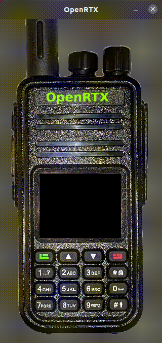

# OpenRTX
## Modular Open Source Radio Firmware

OpenRTX is a free and open source firmware for digitam ham radios, top-down designed
with modularity, flexibility and performance in mind.

Currently OpenRTX is being actively developed for the TYT MD-380/390 and MD-UV380/390.

This firmware is *highly experimental* and is not in a usable state right now,
however contributions and testing are welcome and accepted.

For information on currently supported radios and features, see the [Development status](https://github.com/n1zzo/OpenRTX/wiki/Development-status) wiki page.

For hardware and software documentation visit [openrtx.org](https://openrtx.org/)

## Compile and flash

For instructions on how to compile and flash OpenRTX to your radio,
or just run OpenRTX on Linux see the [How to compile](https://github.com/n1zzo/OpenRTX/wiki/How-to-compile) wiki page.

## Screenshots

## License

This software is released under the GNU GPL v3, the modified wrapping scripts
from Travis Goodspeed are licensed in exchange of two liters of India Pale Ale,
we still owe you the two liters, Travis!

## Credits

OpenRTX was created by:

- Niccolò Izzo IU2KIN <n@izzo.sh>
- Silvano Seva IU2KWO <silseva@fastwebnet.it>
- Federico Amedeo Izzo IU2NUO <federico@izzo.pro>
- Frederik Saraci IU2NRO <frederik.saraci@gmail.it>

All this was made possible by the huge reverse engineering effort of
Travis Goodspeed and all the contributors of [md380tools](https://github.com/travisgoodspeed/md380tools).
A huge thank goes to Roger Clark, and his [OpenGD77](https://github.com/rogerclarkmelbourne/OpenGD77) which not only inspired this project, but as a precursor, provided a working code example for the GD77 radio family.
